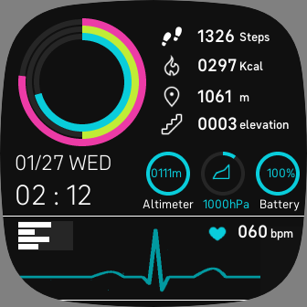

# Clock Face for Fitbit



### App Store

[Modern Circle UI](https://gallery.fitbit.com/details/a442a8df-6452-4f29-a605-5dbc32c2e6b8)
for adk 5
- Versa 3
- Sense

[Modern Circler UI](https://gallery.fitbit.com/details/9cea5b27-d8a0-4b82-8a69-d4bdaa610a8c)
for adk 4
- Versa
- Versa 2
- Versa Lite

### Simple and Modern UI

- Clock
- Heart rate ECG
- Step
- Distance
- Elevation
- Calorie
- Barometer
- Altimeter
- Battery

When the heart rate exceeds 90, the ECG waveform turns yellow, and when it exceeds 120, it turns red.

The pink circle represents the short hands of the clock (sec).
The light green circle represents the long hands of a clock (min).
The blue circle represents the short hands of the clock (hour).

All colors can be changed from the settings.
If you are using an unsupported sensor, ```NONE``` will be displayed.

### Development 

SDK5 project directory is ```modern-circle-ui```.
SDK4 project directory is ```modern-circle-ui-for-sdk4```.
